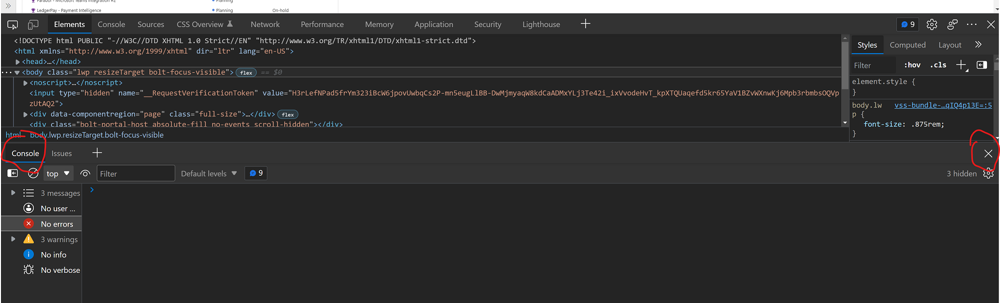

<h1 align="center">Client side debugging with Developer Tools on Chrome/Edge Part 1</h1>

### Duration: 15 minutes
### Participation target:
- [x] Individual Level
- [ ] Partner Level
- [ ] Individual Participant
- [ ] Partner
- [x] Guided

### Prerequisites

Chrome or Edge Web Browser (others may have similar features and you could attempt with them)

## Steps


### Open your Browser (Chrome or Edge preferred)

1. Open a new instance of your selected browser and browse to [https://www.bing.com/](https://www.bing.com/)

### Find and open and customize the developer tools add-in

1. In your selected browser, open **Developer Tools** Snap-in, you can do this two ways, choose one below.
   1. Find the *browser main menu* (normally a ... icon), then select the submenu **More Tools** and click **Developer Tools**
   2. Press Ctrl+Shift I, this should open it automatically on Chrome and Edge, pressing again will toggle it off.
2. Reconfigure the snap-in to be docked at the bottom and resize
   1. You can find the **Dock side** setting in the Developer tools snap-in main menu at the top right of the snap-in (normally a ... icon)
   2. Select each one of the Dock side settings to experience what each layout looks like, with your final selection being docked at the bottom
   3. Resize the snap by dragging the seperation bar (top of the title bar of the snap-in) up and down until you have it a preferred size


### Close the additional Console Window (which also shows Latest News or Changes)

1. Click on the **Elements** tab in Develper Tools snap-in 
2. If you see the window split into two with the bottom half showing a Console section (like the image below), click the X on the right of that section to close that Console window.



### Configure the webpage to display in a specific device configuration or size

1. In the Developer Console window, click on the icon of a phone and tablet (shown in the image below)

2. You will notice the webpage shrink into a smaller area above the Developer Console with a new set of options above the page as shown below

3. Click on the **Dimensions: Responsive** drop down menu and you will be presented with a list of devices, select **iPad Air**
   1. You can also click on **No throttling** here and select throttling to emulate slower connection speeds from devices as well as emulate no connection at all. Select **Mid-tier mobile** (do not refresh the page yet)
   2. You can also click on the **Rotation Icon** to the right next to *No throttling* drop down and it will emulate the page as if the device was in another rotation (try this now). The change will be instant with no page reload.
   3. You can change the resolution of the page to a custom resolution by changing the values in the two text boxes either side of the **x** in the center of the toolbar. Try changing it to 800x600 now. The change will be instant with no page reload.
5. Now hit refresh on the browser and you will see the page load with a delay emulating the **Mid-tier mobile** device, you should observe the elements of the page actually rendering in the elements window below as they become availble.
6. Switch the throttling option back to **No throttling**
7. Now close the size configuration page by clicking once again on the icon of a phone and tablet you clicked in step 1 and the page will return to normal size.


### Exploring the DOM (Document Object Model)

1. With the **Elements** tab selected, you can explore the elements by clicking on the element and the small arrow icons to collapse and expands different nodes in the HTML.
2. Expand the ```<head>``` node near the top and look for the element ```<title>Bing</title>``` in the expanded results and click on it.
3. Now with that line selected, double click on the word *Bing* between the tags and type your name and hit enter.
4. Look at your title bar to see the change.
5. Every element in a document can be changed on the client side like this, these changes are only local for you, but can aid in debugging, saving time when trying out different styles.
6. Now click on the automatic element selector icon to the left of the mobile tablet view button we clicked previously (heres a screenshot again, this time we want the selection in yellow)

7. If you now move your mouse around the actual webpage above the developer console you will see as you hover on things it highlights them, the things it highlights may or may not even be visible to you or an area may be bigger. This is due to you actually navigating the individual Document Model elements associated with that area of the page.
8. Click on the text input box for the bing search, you should see something similar to the image below when you hover over it, when it matches click it.
~[Screenshot of textbox selection](image4.png)
9. The Elements tab below will now show you the element code for what we selected
   - Note: when clicking on an element like we just did, element selection mode will have turned off, selecting another element from the page above the developer console will require you hit the button again (we don't want to now, I just wanted to highlight that)
10.  You will see a property in the selected element named *maxlength* which is set to "1000", double click on the 1000 (between the quotes) and then type 1 to replace the selected 1000 text and hit enter.
11. Now click inside the search box in the webpage above the developer console and try and type something, you will not be able to type anything other than 1 character.
12. Finally note that you can highlight elements in the html inside the elements tab on the webpage by simply moving over a new element with your mouse or cursor. Move over the element ```<div> class="mic_cont icon">``` element to observe the microphone icon in the browser window above highlight when you do so.


### Removing elements

1. Once again click on the automatic element selector icon to the left of the mobile tablet view button we clicked previously.
2. This time move your mouse above the Microsoft Logo at the bottom of the web page, you will see a shaded area appear for the whole width of the page above the black bar with the Microsoft Logo in it. Click on this transparent blue area to select it.
3. Once you have you will see a div selected in the Element window named **msbLogo**.
4. Click on that line in the Elements window and then hit the delete key.
5. Take note of how the additional overlayed information disappeared in the browser.


### Try using the Styles, Computed and Properties tabs

1. To the right of the Elements tab when it is selected, you can observe a window which allows you to alter and view every property (both computed and design time) for the selected element (as well as other debugging tools such as the event listeners associated with controls on the page, we'll cover these and debugging the actual code in a future part of this series.
2. Explore the Styles tab and observe how different styles are applied on different CSS classes and elements, this often causes confusion in design time as you can't see inherited styles as easily as you can through the debugger. This will be extremely useful in identifying CSS issues.
3. Here is a screenshot of something similar to what you will see


### Close the Developer Console

1. To close the developer console and return to your normal browser simply click the X on the top right of the Developer Console or Press CTRL-Shift-I again

