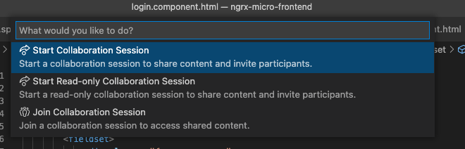
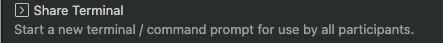

<h1 align="center">Live Share</h1>

### Duration: 15 minutes
### Participation target:
- [ ] Individual Level
- [x] Partner Level
- [ ] Individual Participant
- [ ] Partner
- [x] Guided

### Prerequisites

- VS Code
- GitHub/Microsoft account

## Steps

### Perform a live sharing session
1. Download / install the Live Share Extension Pack for VS Code at [https://marketplace.visualstudio.com/items?itemName=MS-vsliveshare.vsliveshare-pack](https://marketplace.visualstudio.com/items?itemName=MS-vsliveshare.vsliveshare-pack)
2. Click on your username at the bottom of VS Code and select "**Start a Collaboration Session**"

3. Click on your username at the bottom of VS Code and select "**Invite Others (Copy Link)**" and share the link with your assigned partner
4. Click on your username at the bottom of VS Code and select "**Share a Terminal**" 

5. Collaborate on executing the Git Katas at [Kata Git Katas](https://github.com/gpsuscodewith/katas/tree/main/library/kata-git-katas).  Do exercise titled "**Basic Branching**" found at [https://github.com/eficode-academy/git-katas/tree/master/basic-branching](https://github.com/eficode-academy/git-katas/tree/master/basic-branching).  When creating the file called file1.txt in the exercise, have everyone edit the file using the VS Code Live Share capabilities.  
6. Stop

END

**1 minute**: Share results/learnings

**Reflect (example questions)**
1. How would the share a server feature help during team development?  Are there any advantages over Development Containers (future kata).
	
**Take home material for reflection**
1. [https://www.perfomatix.com/live-share-in-visual-studio-code/](https://www.perfomatix.com/live-share-in-visual-studio-code/)
2. [https://code.visualstudio.com/learn/develop-cloud/containers](https://code.visualstudio.com/learn/develop-cloud/containers)
	

### Reflections

[Update this section with post-session from the kata session participants]

### Feedback

[Update this section with any feedback on this kata]
